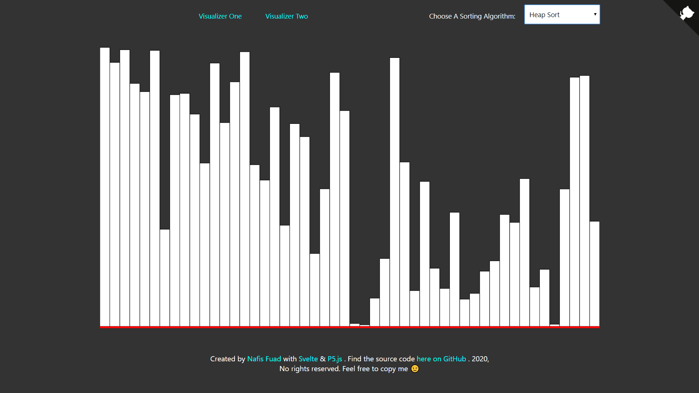

# Sorting Algorithms Visualizer

Built a sorting visualizer to gain a deeper understanding of sorting algorithms. View the project here: https://sorter-viz.now.sh.



**_10 sorting algorithms have been used:_**

1. Bubble Sort
2. Merge Sort
3. Comb Sort
4. Heap Sort
5. Insertion Sort
6. Quick Sort (Hoare and Lomuto)
7. Radix Sort (LSD)
8. Selection Sort
9. Shell Sort
10. Bogo Sort

You can find the algorithms in the `algorithms` directory.
This project uses Svelte and p5.js.

Note: All the algorithms were not implemented solely by me.

### Developing Locally

Install the dependencies...

```bash
# Clone the repo
git clone https://github.com/nfuad/sorter-viz.git
# Move into the cloned repo
cd sorter-viz
# Install the dependencies
npm install
# Start the dev server
npm run dev
```

Navigate to [localhost:5000](http://localhost:5000). You should see your app running.
By default, the server will only respond to requests from localhost. To allow connections from other computers, edit the `sirv` commands in package.json to include the option `--host 0.0.0.0`.

## Building and running in production mode

To create an optimised version of the app:

```bash
npm run build
```

You can run the newly built app with `npm run start`. This uses [sirv](https://github.com/lukeed/sirv), which is included in your package.json's `dependencies` so that the app will work when you deploy to platforms like [Heroku](https://heroku.com).

## Single-page app mode

By default, sirv will only respond to requests that match files in `public`. This is to maximise compatibility with static fileservers, allowing you to deploy your app anywhere.

If you're building a single-page app (SPA) with multiple routes, sirv needs to be able to respond to requests for _any_ path. You can make it so by editing the `"start"` command in package.json:

```js
"start": "sirv public --single"
```

### License

MIT
